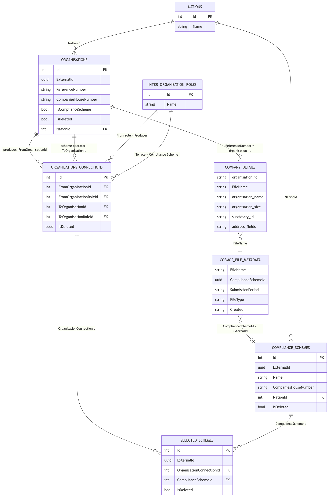
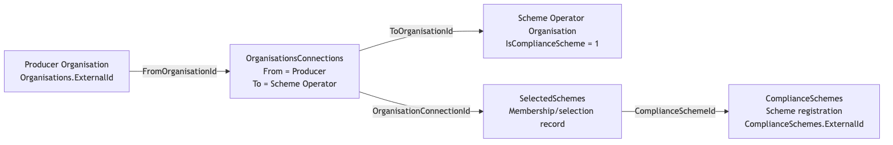
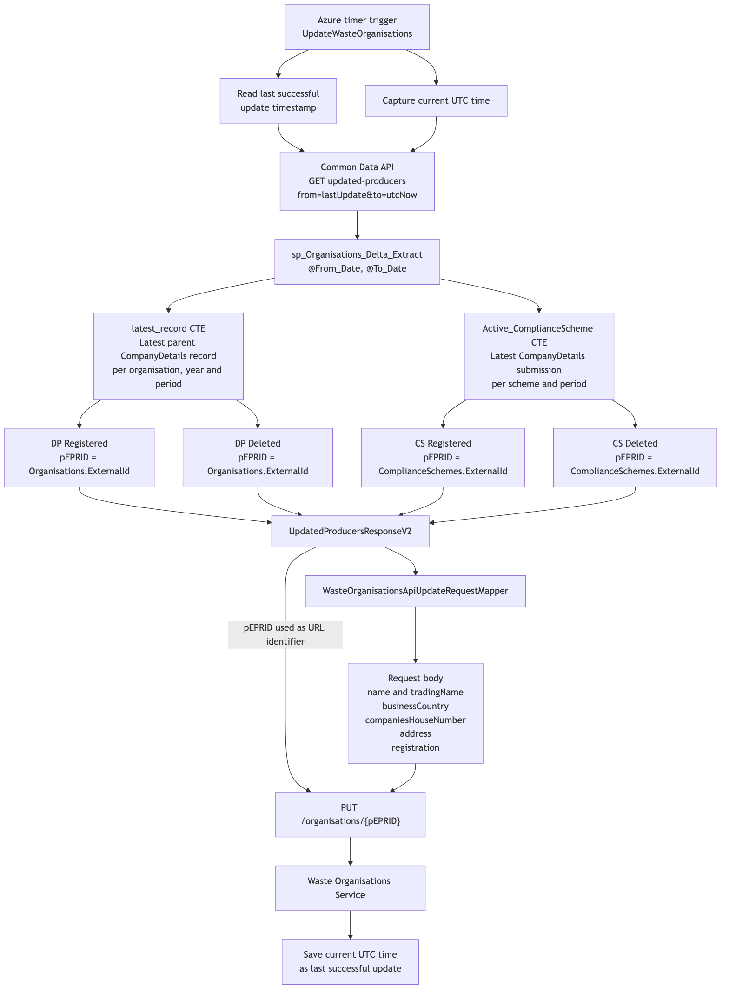
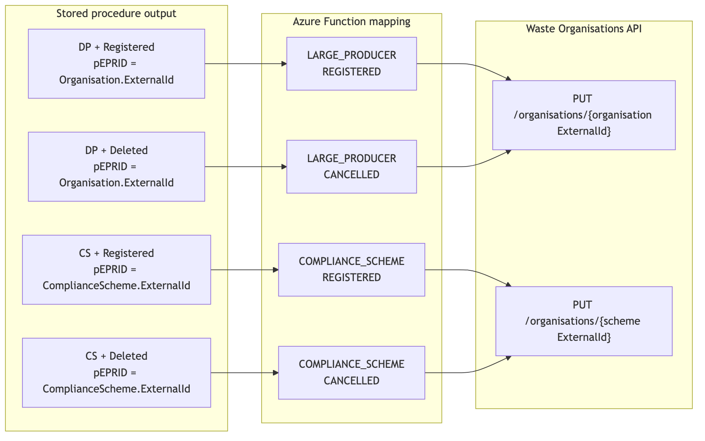

# Organisation / Compliance Scheme

The data model for organisation and compliance schemes is as follows:

The producer to scheme membership is as follows:

The operator organisation and compliance scheme are separate identities:

- The operator contains the organisation’s legal name, address and Companies House number.
- ComplianceSchemes contains the particular scheme name, nation and scheme external ID.
- SelectedSchemes connects a producer/operator relationship to the particular scheme.

The [UpdateWasteOrganisations](https://github.com/DEFRA/epr-prn-integration-function/blob/9d67cf3938c44590416d2b274252804b107afc40/src/EprPrnIntegration.Api/Functions/UpdateWasteOrganisationsFunction.cs#L31-L53) Azure function pulls "organisation" data via the common data API, which internally calls stored procedure [sp_Organisations_Delta_Extract](https://github.com/DEFRA/epr-common-data-api/blob/60f256fb13492f69c0d44294f8a56b7f8dbadff5/src/EPR.CommonDataService.Data/Scripts/Stored%20Procedures/sp_Organisations_Delta_Extract.sql).

Important points to note:

- Scheme-member producer organisations are not returned as individual DP records when their submission is associated with a compliance scheme.
- A producer’s current SelectedSchemes membership is ignored by both DP branches.
- A scheme record is only returned when it can be reached through at least one OrganisationsConnections → SelectedSchemes path.
- pEPRID is polymorphic:
  - DP record: organisation identity.
  - CS record: scheme-registration identity.
- The scheme operator’s organisation ExternalId is never returned as the compliance scheme’s pEPRID.
- Multiple scheme registrations belonging to one operator can therefore produce different pEPRID values while sharing the same organisation name, address and Companies House number.
- UNION ALL permits records from different branches to coexist. DISTINCT only removes duplicates within each individual branch.

The end to end data flow is as follows:

The final record types are as follows:

